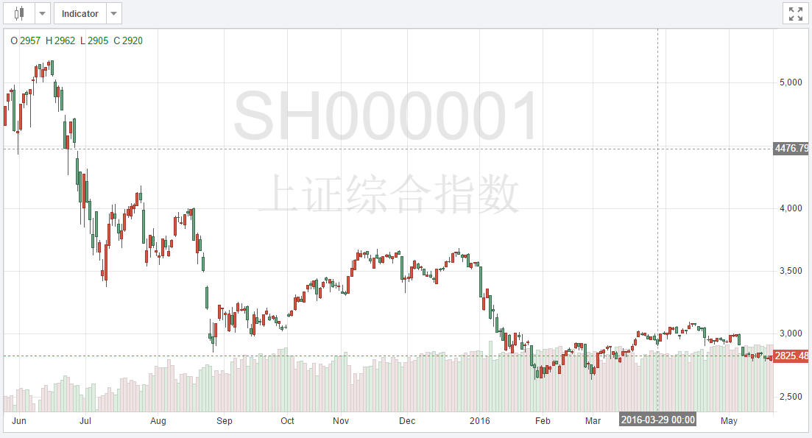

#d3-stock
A simple d3 stock plugin.



Dataset that looks like

```js
var data = {
    "symbol":"AAPL",
    "name":"APPLE INC",
    "list":[
        {"volume":68246139100,"open":95.07,"high":96.62,"close":95.798,"low":94.825,"ma5":95.931,"ma10":95.213,"ma20":95.708,"ma30":95.82,"time":"Mon May 25 00:00:00 +0800 2016"},
        ...
    ]}
```

with a call that looks like

```js
var chart = d3.stock();

var svg = d3.select("#chart").append("svg")
    .attr("width", 700)
    .attr("height", 500)
    .datum(data).call(chart);
```
